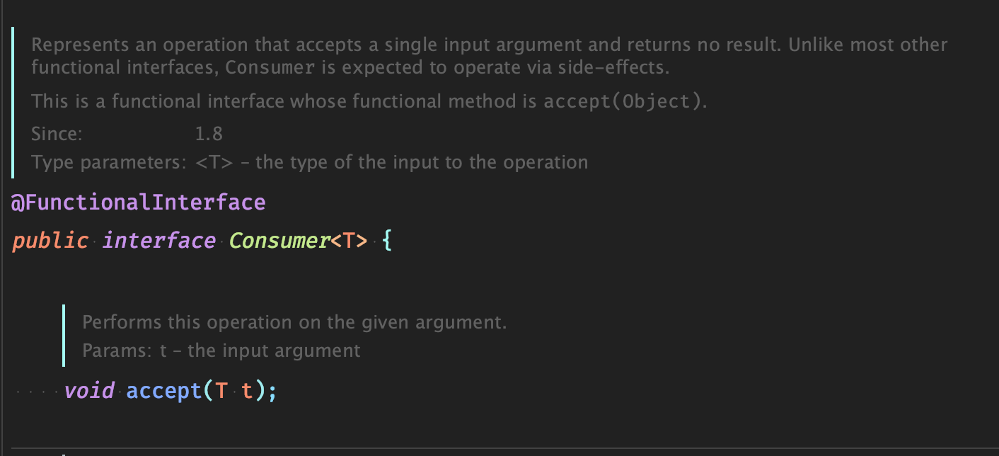
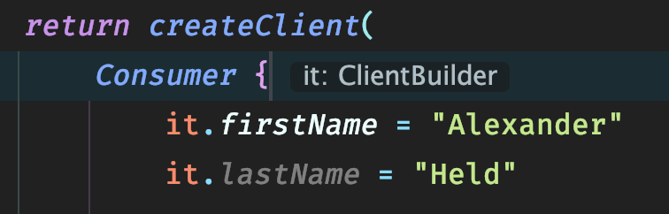

## Rückblick

Während meines ersten Projektes an dem ich als Software Entickler gearbeitet habe, sollte ich einen microservice refactoren - alleine.

Wie ihr euch sicher denken könnt, kommt bei soetwas nur Schwachsinn raus. An manchen Stellen war es völlig over-engineered und an anderen Stellen hat es an Kundenfeedback gefehlt. Achja und während der gesamtem Zeit konnten wir den Service auch nicht deployen, da ja alles "grade besser gemacht wird".

## Das muss doch besser gehen 😤

Unser Ziel ist es, den Builder einfacher lesbarer zu bekommen. Stellt euch vor wir würden in einer komplizierten Domaine unterwegs sein (z.B. AST oder ObjectGraphen generieren ). Da möchte ich möglichst schnell erkennen was dort grade vor sich geht und nicht an Builder Ketten entlanghangeln.

[SourceCode zum mitmachen](https://github.com/alex-held/how-to-refactor-properly)

Wir beginnen unseren Ausflug hier mit dieser Ausgangslage.
`foo()` soll also einen `Client` bauen. Soweit to gut.

###### BuilderExample.java

```java
public class BuilderExample {

 public Client foo() {

  var builder = new ClientBuilder();
  builder.setFirstName("Alexander");
  builder.setLastName("Held");

  var twitterBuilder = new TwitterBuilder();
  twitterBuilder.setHandle("0_alexheld");
  var twitter = twitterBuilder.build();
  builder.setTwitter(twitter);

  var companyBuilder = new CompanyBuilder();
  companyBuilder.setName("MegaCorp");
  companyBuilder.setCity("Cologne");
  var company = companyBuilder.build();
  builder.setCompany(company);

  return builder.build();
 }
}
```

Lass uns loslegen, indem wir uns die Funktionalität aus `BuilderExample.java` kopieren und nach Kotlin portieren.

###### main.kt

``` kotlin
fun createClientInternal(fn: String, ln: String, twitter: String, city: String, company: String): Client {
 val builder = ClientBuilder()
 builder.firstName = fn
 builder.lastName = ln

 val twitterBuilder = TwitterBuilder()
 twitterBuilder.handle = twitter
 builder.twitter = twitterBuilder.build()

 val companyBuilder = CompanyBuilder()
 companyBuilder.city = city
 companyBuilder.name = company
 builder.company = companyBuilder.build()

 return builder.build()
}
```

Wir können am effizentesten immer wieder kleine Verbesserungen machen und experimentieren wenn wir uns darauf verlassen können, dass wir Fehler schnell bemerken. Deswegen decken wir die Grundfunktionalität grob mit Tests ab.

###### MainKtTest.kt

``` kotlin
@Test
fun createClientInternal() {
 val expected = Client("Alexander", "Held", Company("MegaCorp", "Cologne"), Twitter("0_alexheld"))

 val result = createClientInternal(
  expected.firstName,
  expected.lastName,
  expected.twitter.handle,
  expected.company.city,
  expected.company.name
 )

 assertEquals(expected.firstName, result.firstName)
 assertEquals(expected.lastName, result.lastName)
 assertEquals(expected.twitter.handle, result.twitter.handle)
 assertEquals(expected.company.name, result.company.name)
 assertEquals(expected.company.city, result.company.city)
}
```

Während dem schreiben der Tests fällt auf, dass wir um die Clients im Debugger besser von einander unterscheiden zu können uns eine kleine Hilfsfunktion bauen.

``` kotlin
fun Client.toConsoleString(): String {
 return "${twitter.handle} ${company.name}"
}
```

`toConsoleString()` erfüllt zwar ihren Zweck, aber nur wenn ich ich die Funktion aufrufe.

``` kotlin
val Client.consoleString: String
 get() = "${twitter.handle} ${company.name}"
```

So ists besser und lässt sich auch ganz simpel testen 👍🏻
Gleichzeitig haben wir uns noch eine Test Hilfsfunktion gebaut um nicht in jedem Test code zu duplizieren.

###### MainKtTest.kt

``` kotlin
private fun createSubject(
  fn: String = "Alexander",
  ln: String = "Held",
  twitter: String = "0_alexheld",
  city: String = "Cologne",
  company: String = "MegaCorp",
 ): Client = Client(fn, ln, Company(company, city), Twitter(twitter))

@Test
 fun consoleString_should_return_correct_description(){
  val expected = "0_alexheld MegaCorp"
  val subject = createSubject()

  val actual = subject.consoleString

  assertEquals(expected, actual)
 }
```

Okay. Wir könnten anstelle von neue Builder mitten in der Business-Logik zu erzeugen, einfach nur Funktionen weiterreichen, die irgendwann lazy den Client bauen. Somit hätten wir Business Logik bei BusinessLogik und Funktionen bei Funktionen. Das Stichwort ist hier [Kohärenz](<https://de.wikipedia.org/wiki/Koh%C3%A4renz_(Physik)>).


Wir übergeben `createClient` als Parameter die Funktion `accept(cb: ClientBuilder)` mit der der `ClientBuilder` dann konfiguriert werden kann.

###### main.kt

``` kotlin
fun createClient(c: Consumer<ClientBuilder>): Client {
 val builder = ClientBuilder()
 c.accept(builder)
 return builder.build()
}
```

Der nächste Schritt ist es `createClient` aufzurufen. Dazu definieren wir inline ein `object` dass `Consumer<ClientBuilder>` implementiert. Hierzu müssen wir `accept(builder: ClientBuilder)` überschreiben.

###### main.kt

``` kotlin
fun createClientInternal(): Client {
 return createClient(
  object: Consumer<ClientBuilder> {
   override fun accept(builder: ClientBuilder) {
    builder.firstName = "Alexander"
    builder.lastName = "Held"

    val twitterBuilder = TwitterBuilder()
    twitterBuilder.handle = "0_alexheld"
    builder.twitter = twitterBuilder.build()

    val companyBuilder = CompanyBuilder()
    companyBuilder.city = "Cologne"
    companyBuilder.name = "MegaCorp"
    builder.company = companyBuilder.build()
   }

  }
 )
}
```

Jetzt kriegen wir aber von den Tests einen auf den Deckel. Wir fügen hier schnell eine Hilfsmethode hinzu die uns den benötigten `Consumer<ClientBuilder>` herstellt. Schön muss die nicht sein, die wird nur temporär da sein. (Wie das meisste hier..)

###### MainKtTest.kt

``` kotlin
 private fun createConsumer(): Consumer<ClientBuilder> {
  return Consumer<ClientBuilder> {
   it.firstName = "Alexander"
   it.lastName = "Held"
   it.twitter = Twitter("0_alexheld")
   it.company = Company("MegaCorp", "Cologne")
  }
 }

 @Test
 fun createClient_should_return_client_with_same_values() {
  val expected = defaultClient

  val actual = createClient(createConsumer())

  assertEquals(expected.firstName, actual.firstName)
  assertEquals(expected.lastName, actual.lastName)
  assertEquals(expected.twitter.handle, actual.twitter.handle)
  assertEquals(expected.company.name, actual.company.name)
  assertEquals(expected.company.city, actual.company.city)
 }
```

Wir machen aus der inline `Consumer<ClientBuilder>` Implentiertung eine lambda. `builder` übernimmt weiterhin die selbe Rolle: Konfiguration des `ClientBuilders`.

###### main.kt

``` kotlin
fun createClientInternal(): Client {
 return createClient(
  Consumer { builder ->
   builder.firstName = "Alexander"
   builder.lastName = "Held"

   val twitterBuilder = TwitterBuilder()
   twitterBuilder.handle = "0_alexheld"
   builder.twitter = twitterBuilder.build()

   val companyBuilder = CompanyBuilder()
   companyBuilder.name = "MegaCorp"
   builder.company = companyBuilder.build()
  }
 )
}
```

`builder` bennenen wir um nach `it`.
[it](https://discuss.kotlinlang.org/t/it-keyword/6869) hat in kotlin eine besondere Bedeutung. Es ist quasi der default 'Name', wenn es nur einen Lamda Argument gibt.

###### main.kt

``` kotlin
fun createClientInternal(): Client {
 return createClient(
  Consumer { it ->
   it.firstName = "Alexander"
   it.lastName = "Held"

   val twitterBuilder = TwitterBuilder()
   twitterBuilder.handle = "0_alexheld"
   it.twitter = twitterBuilder.build()

   val companyBuilder = CompanyBuilder()
   companyBuilder.name = "MegaCorp"
   it.company = companyBuilder.build()
  }
 )
}
```

Dann löschen wir `it` doch mal. Und die Lambda Pfeile brauchen wir durch `it` auch nicht mehr. Wir können `it` aber trotzdem im scope benutzen wir wir wollen. Der Kompiler weiß was abgeht.



###### main.kt

``` kotlin
fun createClientInternal(): Client {
 return createClient(
  Consumer {
   it.firstName = "Alexander"
   it.lastName = "Held"

   val twitterBuilder = TwitterBuilder()
   twitterBuilder.handle = "0_alexheld"
   it.twitter = twitterBuilder.build()

   val companyBuilder = CompanyBuilder()
   companyBuilder.name = "MegaCorp"
   it.company = companyBuilder.build()
  }
 )
}
```

Als nächstes ersetzen wir in der `createClient` Funcktion den Parameter `c: Consumer<ClientBuilder>)` durch `c: (ClientBuilder) -> Unit`. Wir ersetzen hier eine Implementierung des interfaces `Consumer<ClientBuilder>` durch eine Lamda mit einer anderen Lamda `(ClientBuilder) -> Unit`. Der Vorteil ist, dass wir nicht mehr mehr an die Implentierung der Methode `Consumer<ClientBuilder>.accept(ClientBuilder)` gekoppelt sind.

Wir haben also `createClient` die `(ClientBuilder) -> Unit` als Parameter erwartet. `Unit` bedeutet in dem Fall: die Funktion soll kein Rückgabewert besitzen. Wir können also genau das selbe machen wie die ganze Zeit nur tauschen wir `c.accept(builder)` durch `c(builder)` aus.

###### main.kt

``` kotlin
fun createClient(c: (ClientBuilder) -> Unit): Client {
 val builder = ClientBuilder()
 c(builder)
 return builder.build()
}

fun createClient(): Client {
 return createClient( {
   it.firstName = "Alexander"
   it.lastName = "Held"

   val twitterBuilder = TwitterBuilder()
   twitterBuilder.handle = "0_alexheld"
   it.twitter = twitterBuilder.build()

   val companyBuilder = CompanyBuilder()
   companyBuilder.name = "MegaCorp"
   companyBuilder.city = "Cologne"
   it.company = companyBuilder.build()
  })
}
```

Nächster kleiner Schritt ist die runden Klammern der `createClient()` Funktion zu entfernen.
Der Kotlin Compiler gestattet es runde Klammern für den letzen Parameter wegzulassen. Da wir in diesem Fall nur einen haben, können die Klammern ganz weg.

###### main.kt

``` kotlin
fun createClient(c: ClientBuilder.() -> Unit): Client {
 val builder = ClientBuilder()
 c(builder)
 return builder.build()
}
fun createClient(): Client {
 return createClient {
  it.firstName = "Alexander"
  it.lastName = "Held"

  val twitterBuilder = TwitterBuilder()
  twitterBuilder.handle = "0_alexheld"
  it.twitter = twitterBuilder.build()

  val companyBuilder = CompanyBuilder()
  companyBuilder.name = "MegaCorp"
  companyBuilder.city = "Cologne"
  it.company = companyBuilder.build()
 }
}
```

Und ab jetzt wird es richtig spannnend 😈

Wir ersetzen die Lamda `c: (ClientBuilder) -> Unit` durch eine [Lamda mit Empfänger](https://kotlinexpertise.com/function-literals-with-receiver/) `c: ClientBuilder.() -> Unit`.

Während bei der Lamda `c: (ClientBuilder) -> Unit` ein `ClientBuilder` als Parameter erwartet wird, ist der `ClientBuilder` bei der [Lamda mit Empfänger](https://kotlinexpertise.com/) derjenige der die Lamda ausführt. Dabei kommt wieder `it` ins spiel aber da wir das auch weglassen können können wir direkt auf alle Properties des `ClientBuilder` zugreifen. Ähnlich wie bei einer extension Methode.

###### main.kt

``` kotlin
fun createClient(c: ClientBuilder.() -> Unit): Client {
 val builder = ClientBuilder()
 c(builder)
 return builder.build()
}

fun createClient(): Client {
 return createClient {
  firstName = "Alexander"
  lastName = "Held"

  val twitterBuilder = TwitterBuilder()
  twitterBuilder.handle = "0_alexheld"
  twitter = twitterBuilder.build()

  val companyBuilder = CompanyBuilder()
  companyBuilder.name = "MegaCorp"
  companyBuilder.city = "Cologne"
  company = companyBuilder.build()
 }
}
```

Ich gebe zu der nächste Code Block hat es in sich.
Schau ihn dir erstmal an und dann dekonstruieren wir den mal.

###### main.kt

``` kotlin
fun ClientBuilder.twitter(c: TwitterBuilder.() -> Unit)  {
 twitter = TwitterBuilder().apply(c).build()
}
```

**[1]** `TwitterBuilder().apply(c).build()`

[apply](https://kotlinlang.org/docs/reference/scope-functions.html#apply) hat folgende Signatur:

``` kotlin
inline fun <T> T.apply(block: T.() -> Unit): T
```

Da `T` keine Typeneinschränkungen hat, lässt sich `apply` auf jede Instanz anwenden.
Wenn apply ausgeführt wird, wird es aus dem Kontext des Empfängs aufgerufen, wendet dann die als Parameter mitgegebene Lamda `block: T.() -> Unit` auf den Empfänger an (mutiert seinen State) und gibt den Empfänger als Rückgabewert zurück.

Übersetzen kann man `TwitterBuilder().apply(c).build()` also **sinngemäß** mit

``` kotlin
fun buildTwitter(c: TwitterBuilder.() -> Unit): Twitter {
 var builder = TwitterBuilder()
 c(builder)
 return builder.build()
}
```

<br>

**[2]** `twitter = TwitterBuilder().apply(c).build()`

Wir sind haben weiterhin `ClientBuilder` als Empfänger, daher können wir ohne `this` oder `it` auf `ClientBuilder.setTwitter(t: Twitter)` zugreifen und ihn dem von `TwitterBuilder().apply(c).build()` gebauten `Twitter` zuweisen.

Zur Compilezeit wird `twitter = TwitterBuilder().apply(c).build()` zu `ContainerBuilder.setTwitter(buildTwitter(c))` umgewandelt. **Typensicher!!**

<br>
Was erlaubt uns das jetzt genau?!
Wir können den `TwitterBuilder` aus unserer 'komplexen Business Logik' entfernen.

###### main.kt

``` kotlin
fun createClient(): Client {

 return createClient {
  firstName = "Alexander"
  lastName = "Held"
  twitter {
   handle = "0_alexheld"
  }
  val companyBuilder = CompanyBuilder()
  companyBuilder.name = "MegaCorp"
  companyBuilder.city = "Cologne"
  company = companyBuilder.build()
 }
}

fun createClient(c: ClientBuilder.() -> Unit): Client {
 val builder = ClientBuilder()
 c(builder)
 return builder.build()
}

fun ClientBuilder.twitter(c: TwitterBuilder.() -> Unit)  {
 twitter = TwitterBuilder().apply(c).build()
}

```

Wir führen den letzen Schritt jetzt auch nocheinmal mit dem `CompanyBuilder` durch und kommen zu folgendem Endergebnis.

## Vorher

``` java
public class BuilderExample {

 public Client createClient() {

  var builder = new ClientBuilder();
  builder.setFirstName("Alexander");
  builder.setLastName("Held");

  var twitterBuilder = new TwitterBuilder();
  twitterBuilder.setHandle("0_alexheld");
  var twitter = twitterBuilder.build();
  builder.setTwitter(twitter);

  var companyBuilder = new CompanyBuilder();
  companyBuilder.setName("MegaCorp");
  companyBuilder.setCity("Cologne");
  var company = companyBuilder.build();
  builder.setCompany(company);

  return builder.build();
 }
}
```

## Nachher

``` kotlin

fun createClient(): Client {
 return createClient {
  firstName = "Alexander"
  lastName = "Held"
  twitter {
   handle = "0_alexheld"
  }
  company {
   name = "MegaCorp"
   city = "Cologne"
  }
 }
}
```
