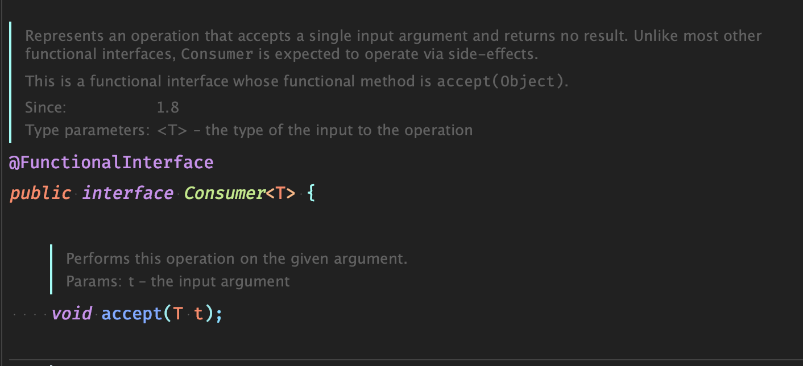
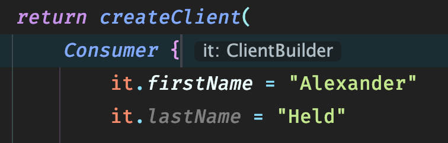

## Rückblick

Während meines ersten Projektes an dem ich als Software Entickler gearbeitet habe, sollte ich einen microservice refactoren - alleine.

Wie ihr euch sicher denken könnt, kommt bei soetwas nur Schwachsinn raus. An manchen Stellen war es völlig over-engineered und an anderen Stellen hat es an Kundenfeedback gefehlt. Achja und während der gesamtem Zeit konnten wir den Service auch nicht deployen, da ja alles "grade besser gemacht wird".

## Das muss doch besser gehen 😤

Unser Ziel ist es, den Builder einfacher lesbarer zu bekommen. Stellt euch vor wir würden in einer komplizierten Domaine unterwegs sein (z.B. AST oder ObjectGraphen generieren ). Da möchte ich möglichst schnell erkennen was dort grade vor sich geht und nicht an Builder Ketten entlanghangeln.

[SourceCode zum mitmachen](https://github.com/alex-held/how-to-refactor-properly)

Wir beginnen unseren Ausflug hier mit dieser Ausgangslage.
`foo()` soll also einen `Client` bauen. Soweit so gut.

###### BuilderExample.java


public class BuilderExample {

 public Client foo() {

  var builder = new ClientBuilder();
  builder.setFirstName("Alexander");
  builder.setLastName("Held");

  var twitterBuilder = new TwitterBuilder();
  twitterBuilder.setHandle("0_alexheld");
  var twitter = twitterBuilder.build();
  builder.setTwitter(twitter);

  var companyBuilder = new CompanyBuilder();
  companyBuilder.setName("MegaCorp");
  companyBuilder.setCity("Cologne");
  var company = companyBuilder.build();
  builder.setCompany(company);

  return builder.build();
 }
}


Lass uns loslegen, indem wir uns die Funktionalität aus `BuilderExample.java` kopieren und nach Kotlin portieren.

###### main.kt


fun createClientInternal(fn: String, ln: String, twitter: String, city: String, company: String): Client {
 val builder = ClientBuilder()
 builder.firstName = fn
 builder.lastName = ln

 val twitterBuilder = TwitterBuilder()
 twitterBuilder.handle = twitter
 builder.twitter = twitterBuilder.build()

 val companyBuilder = CompanyBuilder()
 companyBuilder.city = city
 companyBuilder.name = company
 builder.company = companyBuilder.build()

 return builder.build()
}


Wir können am effizentesten immer wieder kleine Verbesserungen machen und experimentieren wenn wir uns darauf verlassen können, dass wir Fehler schnell bemerken. Deswegen decken wir die Grundfunktionalität grob mit Tests ab.

###### MainKtTest.kt


@Test
fun createClientInternal() {
 val expected = Client("Alexander", "Held", Company("MegaCorp", "Cologne"), Twitter("0_alexheld"))

 val result = createClientInternal(
  expected.firstName,
  expected.lastName,
  expected.twitter.handle,
  expected.company.city,
  expected.company.name
 )

 assertEquals(expected.firstName, result.firstName)
 assertEquals(expected.lastName, result.lastName)
 assertEquals(expected.twitter.handle, result.twitter.handle)
 assertEquals(expected.company.name, result.company.name)
 assertEquals(expected.company.city, result.company.city)
}


Schon während dem Schreiben der Tests fällt auf, dass unterschiedliche `Client` Instanzen im Debugger ähnlich wirken. Besser wir basteln uns eine Hilsproperty.


val Client.consoleString: String
 get() = "${twitter.handle} ${company.name}"


Ist auch ganz simpel testen 👍🏻
Gleichzeitig haben wir uns noch eine Test Hilfsfunktion gebaut um nicht in jedem Test code zu duplizieren.

###### MainKtTest.kt


private fun createSubject(
  fn: String = "Alexander",
  ln: String = "Held",
  twitter: String = "0_alexheld",
  city: String = "Cologne",
  company: String = "MegaCorp",
 ): Client = Client(fn, ln, Company(company, city), Twitter(twitter))

@Test
 fun consoleString_should_return_correct_description(){
  val expected = "0_alexheld MegaCorp"
  val subject = createSubject()

  val actual = subject.consoleString

  assertEquals(expected, actual)
 }


Okay. Wir werden die Erstellung des `Clients` von der technischen Implementierung der Erstellung trennen. Somit gewähren wir, dass Business-Logik bei Business-Logik, Konfiguration bei Konfiguration und Funktionen bei Funktionen anzufinden sind. Das Stichwort lautet hier [Kohärenz](<https://de.wikipedia.org/wiki/Koh%C3%A4renz_(Physik)>).

Die Funktion `createClient` erhält als Parameter die Instruktionen zur Konfiguration eines `ClientBuilder` in Form eines `Consumer<ClientBuilder>`. Wir können nun jederzeit die Funktion `accept(cb: ClientBuilder)` aufrufen, mit der der `ClientBuilder` dann konfiguriert wird.

###### main.kt


fun createClient(c: Consumer<ClientBuilder>): Client {
 val builder = ClientBuilder()
 c.accept(builder)
 return builder.build()
}


Im nächsten Schritt rufen wir `createClient` auf. Wir können uns inline ein `object` definieren, dass `Consumer<ClientBuilder>` implementiert. Wir müssen lediglich `accept(builder: ClientBuilder)` überschreiben.

###### main.kt


fun createClientInternal(): Client {
 return createClient(
  object: Consumer<ClientBuilder> {
   override fun accept(builder: ClientBuilder) {
    builder.firstName = "Alexander"
    builder.lastName = "Held"

    val twitterBuilder = TwitterBuilder()
    twitterBuilder.handle = "0_alexheld"
    builder.twitter = twitterBuilder.build()

    val companyBuilder = CompanyBuilder()
    companyBuilder.city = "Cologne"
    companyBuilder.name = "MegaCorp"
    builder.company = companyBuilder.build()
   }
  }
 )
}


Jetzt kriegen wir aber von den Tests einen auf den Deckel. Wir fügen hier schnell eine Hilfsmethode hinzu die uns den benötigten `Consumer<ClientBuilder>` herstellt. Schön muss die nicht sein, die wird nur temporär da sein. (Wie das meisste hier..)

###### MainKtTest.kt


 private fun createConsumer(): Consumer<ClientBuilder> {
  return Consumer<ClientBuilder> {
   it.firstName = "Alexander"
   it.lastName = "Held"
   it.twitter = Twitter("0_alexheld")
   it.company = Company("MegaCorp", "Cologne")
  }
 }

 @Test
 fun createClient_should_return_client_with_same_values() {
  val expected = defaultClient

  val actual = createClient(createConsumer())

  assertEquals(expected.firstName, actual.firstName)
  assertEquals(expected.lastName, actual.lastName)
  assertEquals(expected.twitter.handle, actual.twitter.handle)
  assertEquals(expected.company.name, actual.company.name)
  assertEquals(expected.company.city, actual.company.city)
 }


Wir machen aus der inline `Consumer<ClientBuilder>` Implentiertung eine Lambda. `builder` übernimmt weiterhin die selbe Rolle: Die Konfiguration des `ClientBuilders`.

###### main.kt


fun createClientInternal(): Client {
 return createClient(
  Consumer { builder ->
   builder.firstName = "Alexander"
   builder.lastName = "Held"

   val twitterBuilder = TwitterBuilder()
   twitterBuilder.handle = "0_alexheld"
   builder.twitter = twitterBuilder.build()

   val companyBuilder = CompanyBuilder()
   companyBuilder.name = "MegaCorp"
   builder.company = companyBuilder.build()
  }
 )
}


`builder` bennenen wir um nach `it`.
[it](https://discuss.kotlinlang.org/t/it-keyword/6869) hat in kotlin eine besondere Bedeutung. Es ist quasi der default 'Name', wenn es nur ein Lamda Argument gibt. Die Umbennenung ist nicht notwendig, hilft aber hoffentlich beim Verstehen des Konzepts.

###### main.kt


fun createClientInternal(): Client {
 return createClient(
  Consumer { it ->
   it.firstName = "Alexander"
   it.lastName = "Held"

   val twitterBuilder = TwitterBuilder()
   twitterBuilder.handle = "0_alexheld"
   it.twitter = twitterBuilder.build()

   val companyBuilder = CompanyBuilder()
   companyBuilder.name = "MegaCorp"
   it.company = companyBuilder.build()
  }
 )
}


Dann löschen wir das überflüssige `it` doch mal. Und die Lambda Pfeile brauchen wir auch nicht mehr. Wir können `it` aber trotzdem im Scope benutzen wir wir wollen. Der Kompiler weiß was abgeht. 😎

###### main.kt


fun createClientInternal(): Client {
 return createClient(
  Consumer {
   it.firstName = "Alexander"
   it.lastName = "Held"

   val twitterBuilder = TwitterBuilder()
   twitterBuilder.handle = "0_alexheld"
   it.twitter = twitterBuilder.build()

   val companyBuilder = CompanyBuilder()
   companyBuilder.name = "MegaCorp"
   it.company = companyBuilder.build()
  }
 )
}


Als nächstes ersetzen wir in der `createClient` Funktion den Parameter `c: Consumer<ClientBuilder>)` durch `c: (ClientBuilder) -> Unit`. Wir ersetzen hier eine Implementierung des interfaces `Consumer<ClientBuilder>` durch eine Lamda mit einer anderen Lamda `(ClientBuilder) -> Unit`. Der Vorteil ist, dass wir nicht mehr mehr an die Implentierung der Methode `Consumer<ClientBuilder>.accept(ClientBuilder)` gekoppelt sind.

Wir haben also `createClient` die `(ClientBuilder) -> Unit` als Parameter erwartet. `Unit` bedeutet in dem Fall: die Funktion soll kein Rückgabewert besitzen. Wir können also genau das selbe machen wie die ganze Zeit nur tauschen wir `c.accept(builder)` durch `c(builder)` aus.

###### main.kt


fun createClient(c: (ClientBuilder) -> Unit): Client {
 val builder = ClientBuilder()
 c(builder)
 return builder.build()
}

fun createClient(): Client {
 return createClient( {
   it.firstName = "Alexander"
   it.lastName = "Held"

   val twitterBuilder = TwitterBuilder()
   twitterBuilder.handle = "0_alexheld"
   it.twitter = twitterBuilder.build()

   val companyBuilder = CompanyBuilder()
   companyBuilder.name = "MegaCorp"
   companyBuilder.city = "Cologne"
   it.company = companyBuilder.build()
  })
}


Nächster kleiner Schritt ist die runden Klammern der `createClient()` Funktion zu entfernen.
Der Kotlin Compiler gestattet es runde Klammern für den letzen Parameter wegzulassen. Da wir in diesem Fall nur einen haben, können die Klammern ganz weg.

###### main.kt


fun createClient(c: ClientBuilder.() -> Unit): Client {
 val builder = ClientBuilder()
 c(builder)
 return builder.build()
}
fun createClient(): Client {
 return createClient {
  it.firstName = "Alexander"
  it.lastName = "Held"

  val twitterBuilder = TwitterBuilder()
  twitterBuilder.handle = "0_alexheld"
  it.twitter = twitterBuilder.build()

  val companyBuilder = CompanyBuilder()
  companyBuilder.name = "MegaCorp"
  companyBuilder.city = "Cologne"
  it.company = companyBuilder.build()
 }
}


Und ab jetzt wird es richtig spannnend 😈

Wir ersetzen die Lamda `c: (ClientBuilder) -> Unit` durch eine [Lamda mit Empfänger](https://kotlinexpertise.com/function-literals-with-receiver/) `c: ClientBuilder.() -> Unit`.

Während bei der Lamda `c: (ClientBuilder) -> Unit` ein `ClientBuilder` als Parameter erwartet wird, ist der `ClientBuilder` bei der [Lamda mit Empfänger](https://kotlinexpertise.com/) derjenige der die Lamda ausführt. Dabei kommt wieder `it` ins spiel aber da wir das auch weglassen können können wir direkt auf alle Properties des `ClientBuilder` zugreifen. Ähnlich wie bei einer extension Methode.

###### main.kt


fun createClient(c: ClientBuilder.() -> Unit): Client {
 val builder = ClientBuilder()
 c(builder)
 return builder.build()
}

fun createClient(): Client {
 return createClient {
  firstName = "Alexander"
  lastName = "Held"

  val twitterBuilder = TwitterBuilder()
  twitterBuilder.handle = "0_alexheld"
  twitter = twitterBuilder.build()

  val companyBuilder = CompanyBuilder()
  companyBuilder.name = "MegaCorp"
  companyBuilder.city = "Cologne"
  company = companyBuilder.build()
 }
}


Ich gebe zu der nächste Code Block hat es in sich.
Schau ihn dir erstmal an und dann dekonstruieren wir den mal.

###### main.kt


fun ClientBuilder.twitter(c: TwitterBuilder.() -> Unit)  {
 twitter = TwitterBuilder().apply(c).build()
}


**[1]** `TwitterBuilder().apply(c).build()`

[apply](https://kotlinlang.org/docs/reference/scope-functions.html#apply) hat folgende Signatur:


inline fun \<T> T.apply(block: T.() -> Unit): T


Da `T` keine Typeneinschränkungen hat, lässt sich `apply` auf jede Instanz anwenden.
Wenn apply ausgeführt wird, wird es aus dem Kontext des Empfängs aufgerufen, wendet dann die als Parameter mitgegebene Lamda `block: T.() -> Unit` auf den Empfänger an (mutiert seinen State) und gibt den Empfänger als Rückgabewert zurück.

Übersetzen kann man `TwitterBuilder().apply(c).build()` also **sinngemäß** mit


fun buildTwitter(c: TwitterBuilder.() -> Unit): Twitter {
 var builder = TwitterBuilder()
 c(builder)
 return builder.build()
}


 

**[2]** `twitter = TwitterBuilder().apply(c).build()`

Wir sind haben weiterhin `ClientBuilder` als Empfänger, daher können wir ohne `this` oder `it` auf `ClientBuilder.setTwitter(t: Twitter)` zugreifen und ihn dem von `TwitterBuilder().apply(c).build()` gebauten `Twitter` zuweisen.

Zur Compilezeit wird `twitter = TwitterBuilder().apply(c).build()` zu `ContainerBuilder.setTwitter(buildTwitter(c))` umgewandelt. **Typensicher!!**

 
Was erlaubt uns das jetzt genau?!
Wir können den `TwitterBuilder` aus unserer 'komplexen Business Logik' entfernen.

###### main.kt


fun createClient(): Client {

 return createClient {
  firstName = "Alexander"
  lastName = "Held"
  twitter {
   handle = "0_alexheld"
  }
  val companyBuilder = CompanyBuilder()
  companyBuilder.name = "MegaCorp"
  companyBuilder.city = "Cologne"
  company = companyBuilder.build()
 }
}

fun createClient(c: ClientBuilder.() -> Unit): Client {
 val builder = ClientBuilder()
 c(builder)
 return builder.build()
}

fun ClientBuilder.twitter(c: TwitterBuilder.() -> Unit)  {
 twitter = TwitterBuilder().apply(c).build()
}


Wir führen den letzen Schritt jetzt auch nocheinmal mit dem `CompanyBuilder` durch und kommen zu folgendem Endergebnis.

## Vorher


public class BuilderExample {

 public Client createClient() {

  var builder = new ClientBuilder();
  builder.setFirstName("Alexander");
  builder.setLastName("Held");

  var twitterBuilder = new TwitterBuilder();
  twitterBuilder.setHandle("0_alexheld");
  var twitter = twitterBuilder.build();
  builder.setTwitter(twitter);

  var companyBuilder = new CompanyBuilder();
  companyBuilder.setName("MegaCorp");
  companyBuilder.setCity("Cologne");
  var company = companyBuilder.build();
  builder.setCompany(company);

  return builder.build();
 }
}


## Nachher


fun createClient(): Client {
 return createClient {
  firstName = "Alexander"
  lastName = "Held"
  twitter {
   handle = "0_alexheld"
  }
  company {
   name = "MegaCorp"
   city = "Cologne"
  }
 }
}

